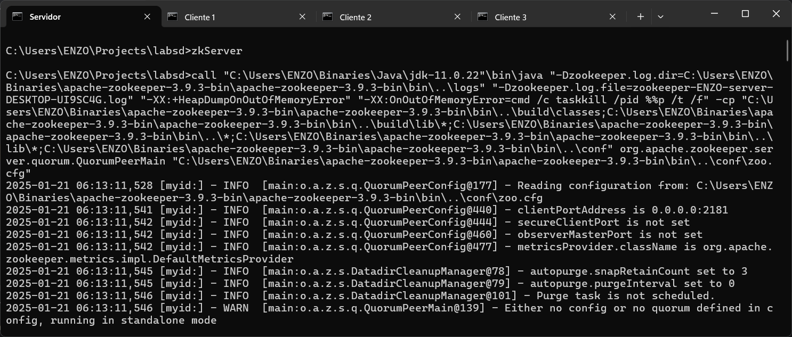
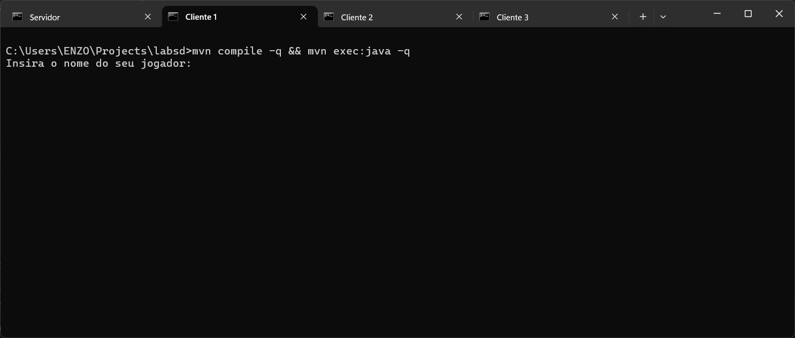
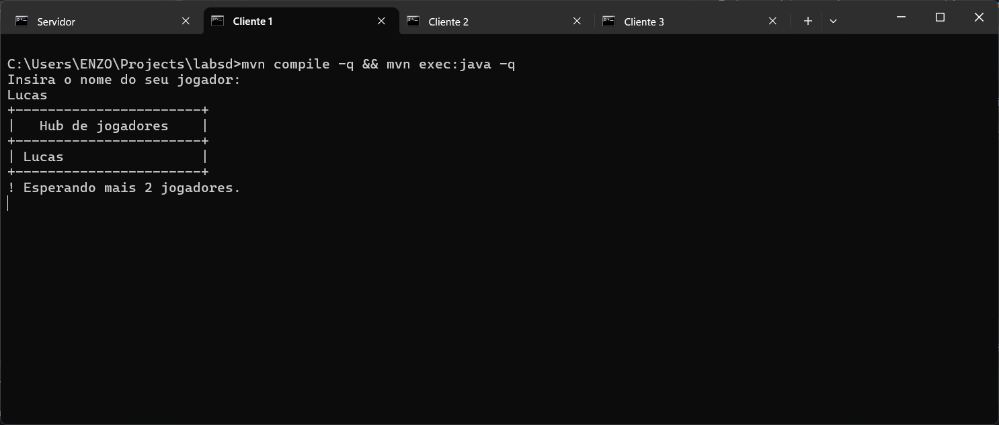
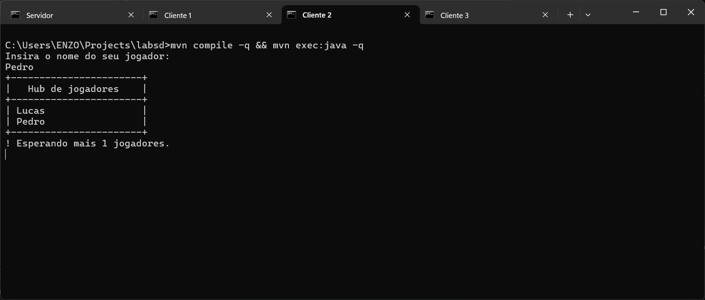
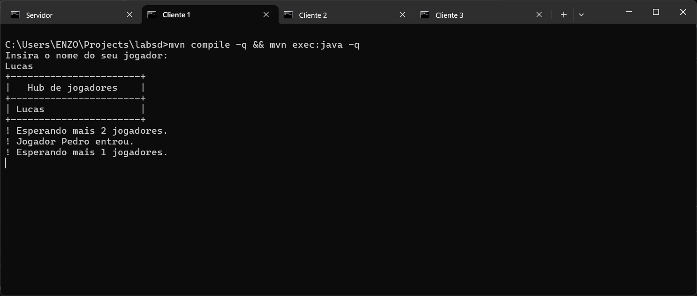
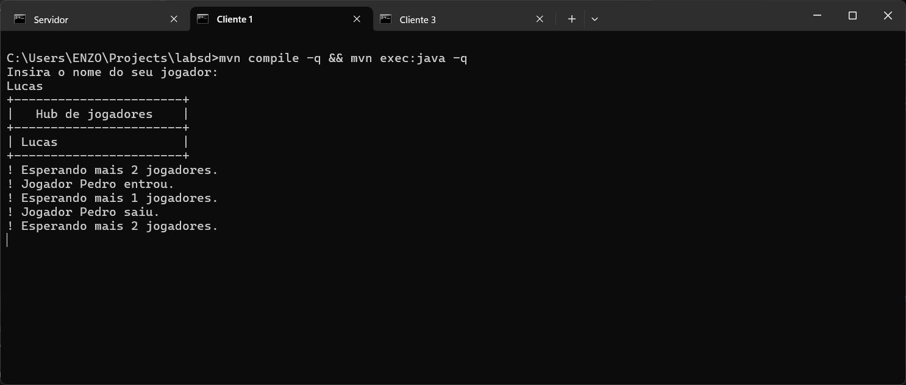
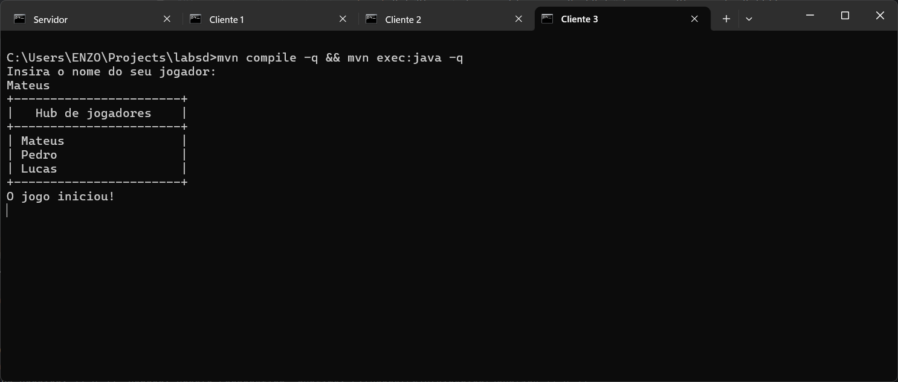

# Laboratório de Sistemas Distribuídos

## Configuração

Os requisitos do projeto são:

- ZooKeeper (versão 3.9.3), acessível por
  meio [deste link](https://dlcdn.apache.org/zookeeper/zookeeper-3.9.3/apache-zookeeper-3.9.3-bin.tar.gz)
- Maven (versão 3.9.9), acessível por
  meio [deste link](https://dlcdn.apache.org/maven/maven-3/3.9.9/binaries/apache-maven-3.9.9-bin.tar.gz)
- Java (versão 11), acessível por meio [deste link](https://www.java.com/pt-BR/download/manual.jsp)

Passos:

1. Descompacte o arquivo _apache-zookeeper-3.9.3-bin.tar.gz_ e adicione o diretório extraído
   _apache-zookeeper-3.9.3-bin/bin_ na variável de
   ambiente PATH. Desta forma, o comando `zkServer` ficará acessível para executar a aplicação servidor.

2. Descompacte o arquivo _apache-maven-3.9.9-bin.tar.gz_ e adicione o diretório extraído _apache-maven-3.9.9/bin_ na
   variável de ambiente PATH. Desta
   forma, o comando `mvn` ficará acessível para executar a aplicação cliente.

3. Verifique se a configuração está válida executando os seguintes comandos:

    ```shell
    $ echo %JAVA_HOME%
    C:\Users\...\Java\jdk-11.0.22
    
    $ %JAVA_HOME%\bin\java -version
    java version "11.0.22" 2024-01-16 LTS
    Java(TM) SE Runtime Environment 18.9 (build 11.0.22+9-LTS-219)
    Java HotSpot(TM) 64-Bit Server VM 18.9 (build 11.0.22+9-LTS-219, mixed mode)
    
    $ mvn --version
    Apache Maven 3.9.9 (8e8579a9e76f7d015ee5ec7bfcdc97d260186937)
    Maven home: C:\Users\...\apache-maven-3.9.9-bin\apache-maven-3.9.9
    Java version: 11.0.22, vendor: Oracle Corporation, runtime: C:\Users\...\Java\jdk-11.0.22
    Default locale: pt_BR, platform encoding: Cp1252
    OS name: "windows 11", version: "10.0", arch: "amd64", family: "windows"
    ```

## Testes

Para construir os testes automatizados, foram utilizadas as bibliotecas

- JUnit (versão 5.9.2), acessível via [Maven](https://mvnrepository.com/artifact/org.junit.jupiter/junit-jupiter-engine)
- Curator Testing (versão 5.4.0), acessível
  via [Maven](https://mvnrepository.com/artifact/org.apache.curator/curator-test)


## Implementação

### Barreira simples

### Barreira dupla

A classe `br.ufpa.icen.lib.ZooKeeperDoubleBarrier` possui dois métodos disponíveis para teste:
`enterBarrier`, utilizado pelo cliente para entrar na barreira e possivelmente aguardar outros clientes iniciarem o
processamento, e `exitBarrier`, utilizado pelo cliente para sair da barreira e possivelmente aguardar outros clientes 
terminarem o processamento.

Supondo que cada cliente possui algo a ser feito (como ler uma planilha e extrair informações), existem quatro etapas de vida para cada um:

1. **execução**: o cliente aguarda os demais clientes entrarem na primeira barreira; ocorre quando o processo do cliente iniciou com sucesso e já está na primeira barreira
2. **processamento**: o cliente faz o que precisa ser feito; ocorre quando todos os clientes já estão na primeira barreira
3. **finalização**: o cliente aguarda os demais clientes entrarem na segunda barreira; ocorre quando o cliente termina o que precisava ser feito
4. **encerramento**: o cliente é encerrado; ocorre quando todos os clientes já estão na segunda barreira

As etapas de sincronização são **execução** e **finalização**: todos os clientes entram em **processamento** e em **encerramento** ao mesmo tempo.

Supondo que três clientes precisem realizar uma operação em conjunto com base em um nó `/barreira` que implementa barreiras duplas, o seguinte ocorre:

#### Primeira barreira

- O cliente C1 entra em **execução**, cria um nó `/barreira/C1`, verifica quantos nós já existem na barreira (apenas 1) e aguarda o nó `/ready` ser criado
- O cliente C2 entra em **execução**, cria um nó `/barreira/C2`, verifica quantos nós já existem na barreira (2) e aguarda o nó `/ready` ser criado
- O cliente C3 entra em **execução**, cria um nó `/barreira/C3`, verifica quantos nós já existem na barreira (3), e, por verificar que já atingiu a quantidade de nós esperada, cria o nó `/ready`
- O ZooKeeper notifica todos os clientes da criação do nó `/ready` e os clientes entram em **processamento** assim que recebem esta notificação


```java
public void enterBarrier() throws KeeperException, InterruptedException {
    // 1. Create a name n = b+"/"+p
    final String n = barrierNode + "/" + id;

    // 2. Set watch: exists(b + "/ready", true)
    zk.exists(barrierNode + "/ready", true);

    // 3. Create child: create( n, EPHEMERAL)
    zk.create(n,
        // Guarda a data de criação deste nó para consulta em `exitBarrier`
        LocalDateTime.now().format(DateTimeFormatter.ISO_LOCAL_DATE_TIME).getBytes(StandardCharsets.UTF_8),
        ZooDefs.Ids.OPEN_ACL_UNSAFE,
        CreateMode.EPHEMERAL
    );

    // 4. L = getChildren(b, false)
    final List<String> children = zk.getChildren(barrierNode, false);
    if (children.size() < 3) {
        // 5. if fewer children in L than x, wait for watch event
        enterLatch.await();
    } else {
        // 6. else create(b + "/ready", REGULAR)
        zk.create(barrierNode + "/ready", new byte[0], ZooDefs.Ids.OPEN_ACL_UNSAFE, CreateMode.EPHEMERAL);
    }
}
```

#### Segunda barreira

## Uso

A aplicação implementa um _lobby_ de jogadores simples, onde cada cliente acompanha o _status_ do _hub_: quando um
jogador
entra,
quando um jogador sai, e quantos jogadores faltam para começar a partida.

Os comandos dessa seção assumem que os seguintes comandos foram executados:

```shell
$ git clone https://github.com/enzo-santos-ufpa/labsd
$ cd labsd
```

### Servidor

Na primeira execução do servidor, adicione um arquivo chamado _zoo.cfg_ (cujo conteúdo está presente na raiz deste
repositório) no diretório _apache-zookeeper-3.9.3-bin/conf_, extraído no passo 1 da seção Configuração.

Rode o seguinte comando em um _prompt_ de comando separado:

```shell
$ zkServer
```

Este comando irá iniciar o servidor, conforme imagem abaixo.



Não feche este _prompt_ de comando enquanto a aplicação for executada.

### Cliente

Um _prompt_ de comando deve ser executado para cada cliente.

Rode o seguinte comando em um novo _prompt_ de comando (**PC1**):

```shell
$ mvn compile
$ mvn exec:java
```

Este comando irá iniciar uma aplicação cliente, conforme imagem abaixo.



Insira o nome de um jogador a entrar no _hub_ e aperte Enter:



Rode o mesmo comando em um novo _prompt_ de comando (**PC2**) e insira o nome de outro jogador:



Note que o nome do primeiro jogador adicionado anteriormente já está no _hub_.

Volte no **PC1** e note que o nome do jogador adicionado posteriormente foi identificado em tempo real:



Feche o **PC2** e note que o nome do último jogador adicionado terá sido identificado como ausente no **PC1**:



Abra novamente o **PC2** e adicione novamente o seu jogador respectivo.

Rode o mesmo comando em um novo _prompt_ de comando (**PC3**) e insira o nome do último jogador:



Note que o jogo foi iniciado com sucesso, visto que já existem 3 jogadores.
